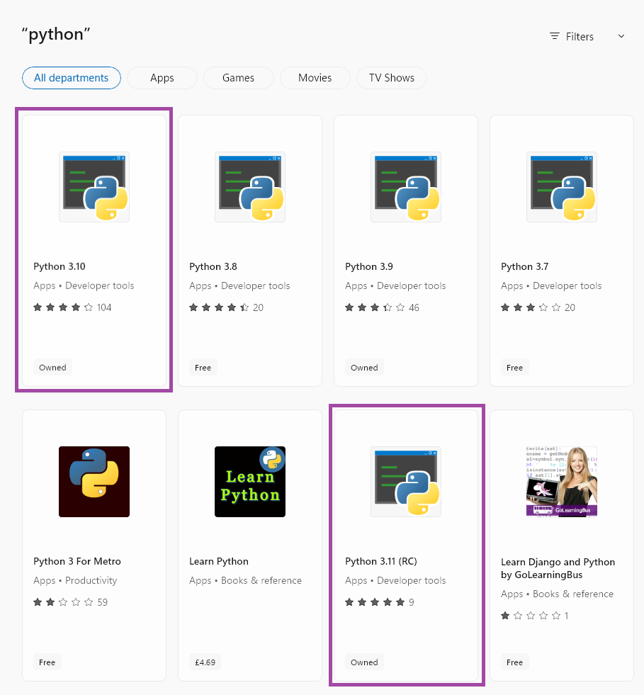

## Python Installation

If you don't have Python already you can fetch it easily from the Windows Store. Simply type `store` into the windows search bar. To run this GUI you'll need the latest version, Python 3.11 (RC).



If you install Python straight from `python.org` instead remember to click 'Add Python environmental variables', this is important.

## Install Code

Once Python is installed:

Create a directory in the location you wish to install the GUI. This can be anywhere.

Copy the `__main__.py` file from the code files into this directory. (Copy paste will do but ensure the file name is exactly `__main__.py`)

Then type `powershell.exe` into the explorer bar as shown in the image below.


This will open a Powershell in the current directory.

Then use the command `pip install voicemeeter-compact` and wait for the required packages to install.

## Use

You will need to set the kind of Voicemeeter you want to run in the `__main__.py` file. Just edit the kind_id line to one of the following:

-   basic
-   banana
-   potato

```python
if __name__ == "__main__":
    # choose the kind of Voicemeeter (Local connection)
    kind_id = "banana"
```

Finally, in powershell, run the GUI with the command `pythonw .`

If the GUI looks like the image below when you first load it, then no channels are labelled. From the menu, Configs->Load config, you may load an example config. Save your current Voicemeeter settings first :).


## Updates

If there are updates to the app, you can track them in the [CHANGELOG](CHANGELOG.md)

To install any updates simply open a Powershell in the install directory as explained above, then use the commmand `pip install voicemeeter-compact -U`
